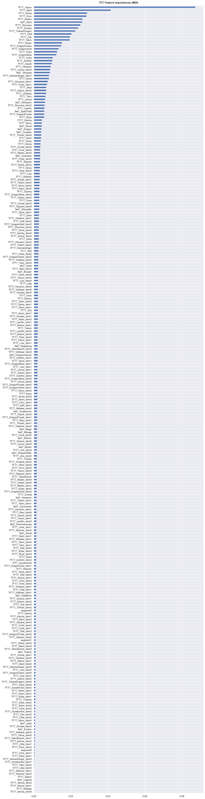

[](https://www.python.org/downloads/release/python-3100/)


 <!--  -->
 

##
Datasets publish @
https://www.kaggle.com/datasets/teckmengwong/team-fight-tactics-matches

## Requirements

To develop and use this code, you will need:

- a Riot Games Developer account at <https://developer.riotgames.com/>
- a Riot Games API key

In your `.bashrc`, `.zshrc`, or equivalet, export the Riot Games API key as `RIOT_API_KEY`.
For windows, in your sys/user environment.

```
export RIOT_API_KEY="RGAPI-blah-blah-blah"
```

- Python >= `3.10`
- Packages included in `requirements.txt` file
- (Anaconda for easy installation)

### Python virtual env setup
For local setup, I recommend to use [Miniconda](https://docs.conda.io/en/latest/miniconda.html), a minimal version of the popular [Anaconda](https://www.anaconda.com/) distribution that contains only the package manager `conda` and Python. Follow the installation instructions on the [Miniconda Homepage](https://docs.conda.io/en/latest/miniconda.html).

After installation of Anaconda/Miniconda, run the following command(s) from the project directory:

### Install dependencies
Conda virtual environment:
```sh
conda create --name myenv python=3.10
conda activate myenv
conda install --file requirements.txt -c conda-forge
```

As **Conda has limited package support for python 3.10** activate your virtual environment and install the dependencies using

```sh
pip install -r requirements.txt
```

## Usage for Jupyter Notebook
Activate and install the correct python3 virtual environment before proceeding.

```sh
jupyter notebook
```

## Scraping script /backend/app/scrape.py

Config:
```
SERVER = 'na1'  # euw1 na1 kr oc1
LEAGUE='challengers'
MAX_COUNT = 30
```

To run:
```
cd backend/app
python3 scrape.py
```

# Datasets
## About this dataset
Team Fight Tactics highest ELO challengers games scrape by https://github.com/furyhawk/tftchamp.
Using https://developer.riotgames.com/ API.

8 players FFA in one game.

**Target Label**: *placement*
1 is best. Lower is better.
Top 4 placement is a Win.
Alternative prediction is to group Top 4 placement as Binary Win, bottom 4 as Binary Lost.

Only team traits and augments/items chosen included in datasets.
Stats like game_length, players_eliminated are excluded. This is to prevent the model from learning obvious predictor.

## Challenges:

- Different baseline between games(match_id). Different games has different baseline at different ELO. This may affect the true value of Global placement.
- Categorical values.

```
## Example
{'match_id': 'EUW1_5944909932', #Match id.
 'placement': 2, # target_label.

# max 3 augments player can choose at stage 2-2, 3-2, 4-2.
 'augment0': 'TFT6_Augment_TrueTwos',
 'augment1': 'TFT6_Augment_CyberneticImplants2',
 'augment2': 'TFT6_Augment_SecondWind2',

# traits
 'Set7_Assassin': 1,
 'Set7_Bruiser': 1,
 'Set7_Cavalier': 2,
 'Set7_Dragonmancer': 0,
 'Set7_Guild': 3,
 'Set7_Legend': 0,
 'Set7_Mirage': 0,
 'Set7_Ragewing': 1,
 'Set7_Swiftshot': 1,
 'Set7_Tempest': 1,
 'Set7_Warrior': 1,

# units/items
 'TFT7_Sejuani': 2,
 'TFT7_Qiyana': 2,
 'TFT7_Shen': 2,
 'TFT7_Shen_item0': 'TFT_Item_ChainVest',
 'TFT7_Shen_item1': 'TFT_Item_Shroud',
 'TFT7_Twitch': 2,
 'TFT7_Twitch_item0': 'TFT_Item_MadredsBloodrazor',
 'TFT7_Hecarim': 2,
 'TFT7_Talon': 2,
 'TFT7_Talon_item0': 'TFT_Item_RedBuff',
 'TFT7_Talon_item1': 'TFT_Item_InfinityEdge',
 'TFT7_Talon_item2': 'TFT7_Item_CavalierEmblemItem',
 'TFT7_Xayah': 2,
 'TFT7_Xayah_item0': 'TFT_Item_GuardianAngel',
 'TFT7_Xayah_item1': 'TFT_Item_InfinityEdge',
 'TFT7_Xayah_item2': 'TFT_Item_GuinsoosRageblade',
 'TFT7_Ornn': 2,
 'TFT7_Ornn_item0': 'TFT_Item_GiantsBelt',
 'TFT7_Ornn_item1': 'TFT_Item_Shroud',
 'TFT7_Yasuo': 1,
 'TFT7_Yasuo_item0': 'TFT_Item_RapidFireCannon',
 'TFT7_Yasuo_item1': 'TFT_Item_MadredsBloodrazor',
 'TFT7_Yasuo_item2': 'TFT_Item_TitansResolve'
}

**MetadataDto**
Name 	Data Type 	Description
data_version 	string 	Match data version.
match_id 	string 	Match id.
participants 	List[string] 	A list of participant PUUIDs.

**InfoDto**
Name 	Data Type 	Description
game_datetime 	long 	Unix timestamp.
game_length 	float 	Game length in seconds.
game_variation 	string 	Game variation key. Game variations documented in TFT static data.
game_version 	string 	Game client version.
participants 	List[ParticipantDto] 	
queue_id 	int 	Please refer to the League of Legends documentation.
tft_set_number 	int 	Teamfight Tactics set number.

**ParticipantDto**
Name 	Data Type 	Description
companion 	CompanionDto 	Participant's companion.
gold_left 	int 	Gold left after participant was eliminated.
last_round 	int 	The round the participant was eliminated in. Note: If the player was eliminated in stage 2-1 their last_round would be 5.
level 	int 	Participant Little Legend level. Note: This is not the number of active units.
placement 	int 	Participant placement upon elimination.
players_eliminated 	int 	Number of players the participant eliminated.
puuid 	string 	
time_eliminated 	float 	The number of seconds before the participant was eliminated.
total_damage_to_players 	int 	Damage the participant dealt to other players.
traits 	List[TraitDto] 	A complete list of traits for the participant's active units.
units 	List[UnitDto] 	A list of active units for the participant.

**TraitDto**
Name 	Data Type 	Description
name 	string 	Trait name.
num_units 	int 	Number of units with this trait.
style 	int 	Current style for this trait. (0 = No style, 1 = Bronze, 2 = Silver, 3 = Gold, 4 = Chromatic)
tier_current 	int 	Current active tier for the trait.
tier_total 	int 	Total tiers for the trait.

**UnitDto**
Name 	Data Type 	Description
items 	List[int] 	A list of the unit's items. Please refer to the Teamfight Tactics documentation for item ids.
character_id 	string 	This field was introduced in patch 9.22 with data_version 2.
chosen 	string 	If a unit is chosen as part of the Fates set mechanic, the chosen trait will be indicated by this field. Otherwise this field is excluded from the response.
name 	string 	Unit name. This field is often left blank.
rarity 	int 	Unit rarity. This doesn't equate to the unit cost.
tier 	int 	Unit tier. 
```